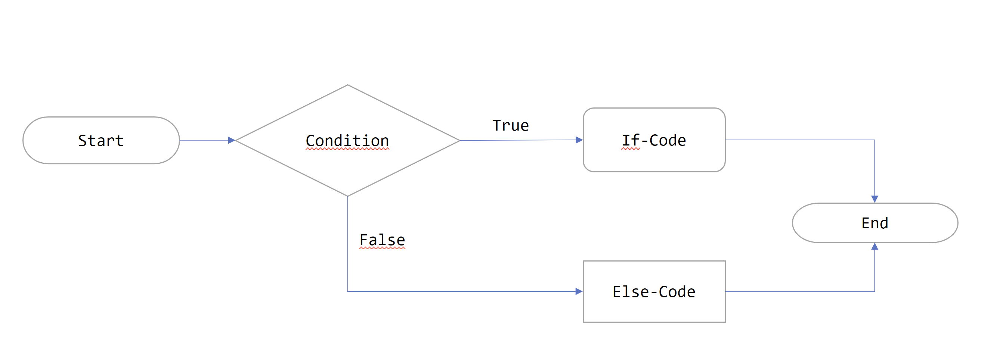
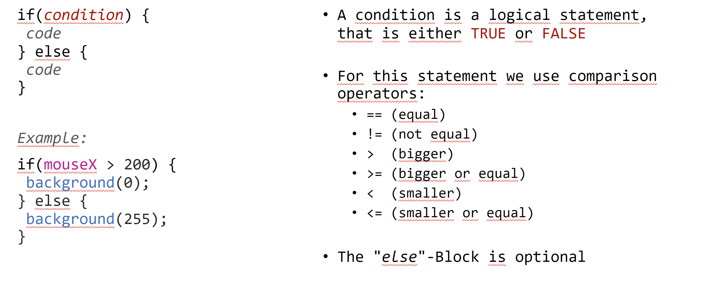

# Session 1 | 10.10.2022 - Computational Thinking

***Disclaimer:*** *This page offers supporting material for an Interaction Design course held at [KISD](https://kisd.de) in the winter term 2022/23. Visit the [landing page](https://github.com/KISDinteractive/fundamentals22w) of this course for more information.*

### Links Used During the Session

- Open the p5.js editor](https://editor.p5js.org)

- Check out some examples directly in p5.js](https://editor.p5js.org/KISDinteractive/sketches)

## Session Content

### Formalities

- 5 meetings (10.10. - 07.11.22) on Mondays from 10-12 & 13-16 o'clock

- We agreed on a punctuality tolerance of 10 minutes.

- 3 coffee breaks of 15 mins - please be back on time

### Kitchen Metaphor

- We proposed a metaphor comparing coding to a cook in a kitchen. The cook has no human qualities (e.g. intelligence, common sense, ...) but is a " stupid" machine that can only execute commands and do calculations:

  - Kitchen = **Computer**​

  - Cook = **Processor**

- In the kitchen there is already a some kind of instruction manual, that documents how to use the kitchen. In code this *book* is called **operating systems** (e.g. Windows or MacOs) and is already placed in the *kitchen*.

- In addition, there are many books on the shelf (called **Reference** or **Syntax** in code) that document how to use various programming languages, much as a dictionary would document the use of a spoken or written language.

- To get a meal from the cook, we need to tell the cook how to do each cooking step - in code these steps are called **instructions**.

- Because we may want the same food again at a later time, we write all the instructions down in a recipe. Something you would call a **sketch**: a document that represents all the steps of the desired process.

- Some of the tasks in cooking are repetitive and occur again and again in different recipes. These sets of instructions that make up a task are called **functions** in code and can be used over and over again. In the kitchen metaphor, think of them as another "beginner's cookbook" on the shelf. If you like, you can write your own functions!

### 1st Exercise in p5js: Drawing rects

**Task:** Draw a blue rectangle with a white outline on black background.

**Sample Solution:** [link to code file](src/task1-rectangle.js)

**Notes:**

- Code in the **setup() function** is only called once, while the **draw() function** is repeated over and over again until the sketch gets stopped

- **Curly braces "{ ... }"** form a code block and hold together functions

- **Parantheses "( ... )"** hold parameters in order to specify functions, multiple parameters are separated by a **comma ","**  

- A **semicolon ";"** ends an instruction. We add a linebreak for visual clarity.

- `createCanvas(400, 400);` creates an area of 400 by 400 pixels in which we can draw stuff.

- `background(220);` fills this canvas with the greyscale color of *220*

- `rect(50, 50, 200, 100);` creates a rectangle at the position x=50 and y=50 (from the upper left canvas edge) with a size of 200 pixels to 100 pixels (landscape).

- Putting `fill(0,0,255);` *before* our rect will cause it to be filled blue. Here the **color** is set by defining the red, green and blue (rgb) value between 0-255.

- Putting `stroke(255);` *before* our rect will cause it to have a white outline. Here the **color** is set by defining a greyscale value (0-255). One could also use rgb like above.

### 2nd Exercise (Individual Task): Adding Objects

- **Task:** Add a red rectangle with green outline and a circle of any colour that is in one of the rectangles.

- **Students' Outcomes**: [link to folder](students-outcomes/task2-circle).

- **Sample solution:** you can find *one* possible solution in [this code file](src/task2-circle.js).

- **Notes:** The solution can be achieved by repeating the 1st task for another rectangle and then adding a circle ( `circle(150,100,70);`). Note that `fill()`and `stroke()` apply to **all** of the following shapes until you  either
  - a) change them (by using `fill()`and `stroke()`again) or
  
  - b) get rid of them by using `noFill()`and `noStroke()` (which again applies for all of the following shapes)

### 3rd Exercise (individual task): Creatures

- **Students' Outcomes**: [link to folder](students-outcomes/task3-creature).

### 3rd Exercise (individual task): Interaction

- **Students' Outcomes**: [link to folder](students-outcomes/task4-interaction).

**Notes:**

- Interaction describes the relationship between action and reaction between two or more systems

- In information theory, _systems_ describe structures in which information entered through inputs of the system, is transformed internally and leaves the system through outputs

- For systems to interact, their respective inputs/outputs must be compatible  
  
  

- Functions can also be described as systems that take parameters as inputs. In this case, to make the colour and size of a rectangle interactive, in this case mouseX and mouseY are used to replace the static values.
  
  

### Conditionals:

- Conditionals are used to control the flow of code:

## Homework: Install Processing!

Go to [Processing.org](https://processing.org/download) and download the app that matches your system. 

Install it, go to File > Examples > Basics > Structure > Coordinates (double click to open)

Press on the play button to see if the code runs. You have succeeded, if you see a blue line crossing an orange rectangle.

Mail us, if you have any problems!
