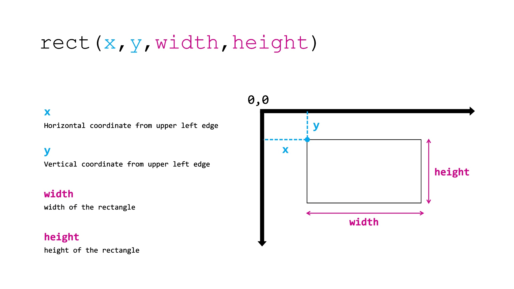
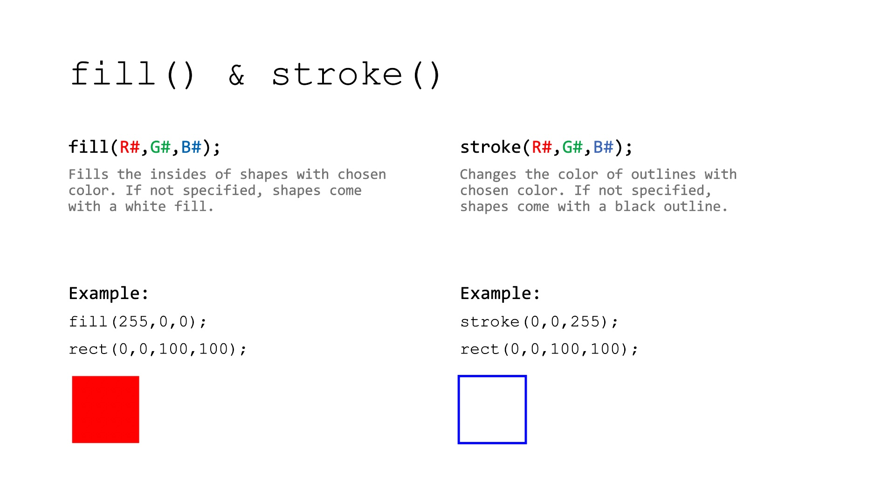
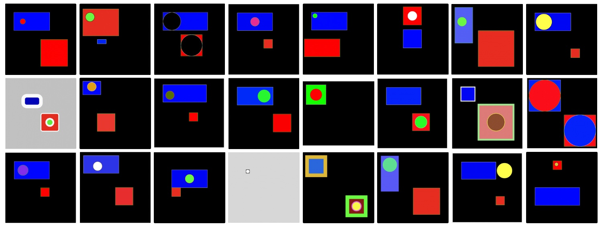
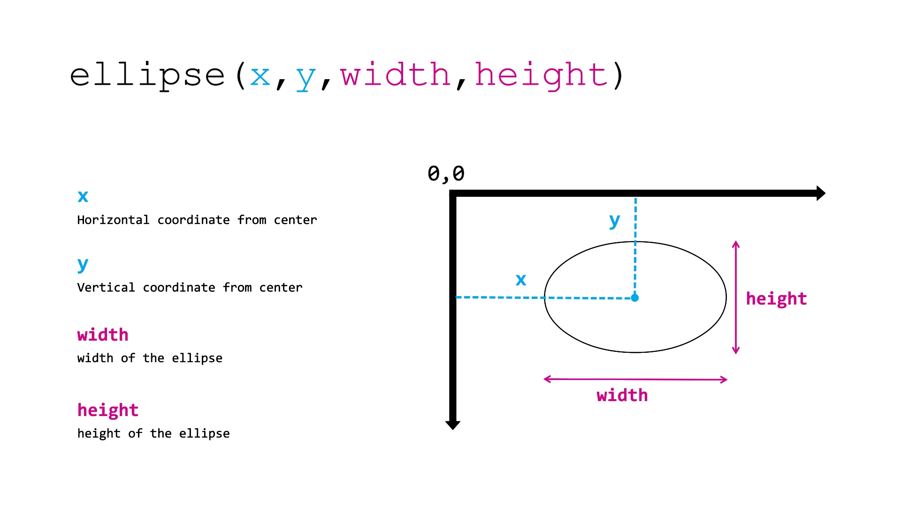
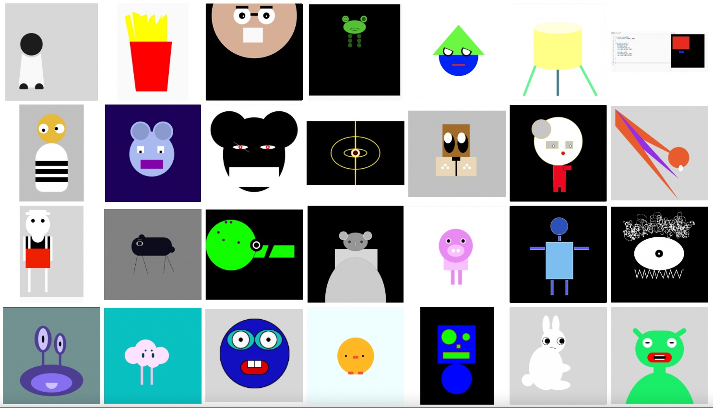
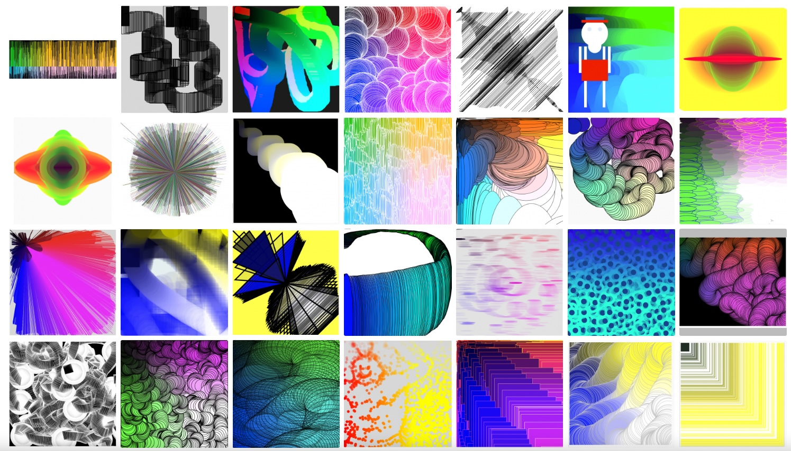
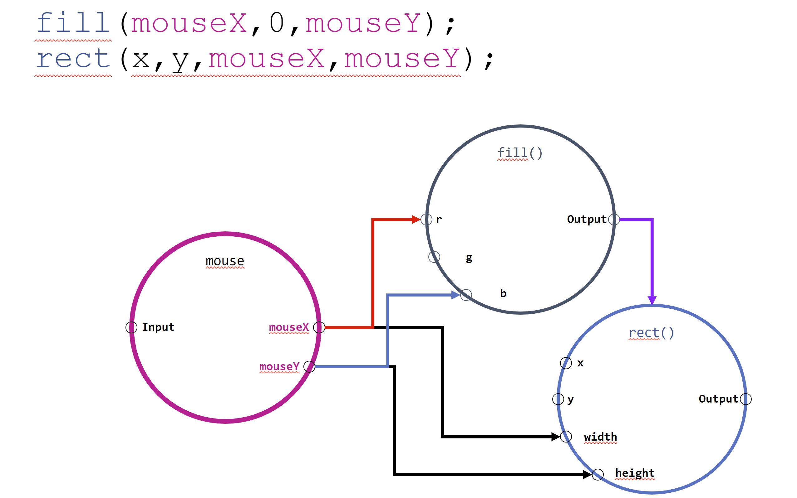

# Session 1 | 10.10.2022 - Computational Thinking

### Links Used during the Session

- [Open the p5.js editor](https://editor.p5js.org)

- [Check some examples directly in p5.js](https://editor.p5js.org/KISDinteractive/sketches)

## Session Content

### Formalities

- 5 Meetings (10.10. – 07.11.22) on Mondays from 10–12 & 13–16 o'clock

- We agreed on a punctuality tolerance of 10 mins.

- 3 Coffee Breaks of 15 mins – please be back on time

### Kitchen Metaphor

- We proposed a metaphor that compares coding with a cook in a kitchen. The cook, however, has no human qualities (e.g. intelligence, commons sense, ...) but is a "stupid" machine that can only execute commands and do calculations:
  
  - Kitchen = **Computer**​
  
  - Cook = **Processor**

- In the kitchen there already is some kind of instruction manual, that documents how to use the kitchen. In code this *book* is called **operating systems** (e.g. Windows or macos) and is already placed in the *kitchen*.

- In addition, there are numerous books on the shelf ( referred to as **Reference** or **Syntax** in code) that document how to use various programming languages, much like a dictionary would document the use of a spoken or written language.

- To get a meal from the cook, we need to instruct the cook to do all the individual cooking steps - in the code, these steps are called **instructions**.

- As we might want the same food again at a later point in time, we write all instructions down in a recipe. Something you would refer to as a **sketch**: a document that represents all the steps of the desired process.​

- Some of the task in cooking are repetitive and occur repeatedly in different recipes. These sets of instructions that form a task are called **functions** in code and can be used over and over again. In the kitchen metaphor imagine them beeing a further "beginners cooking book" in the shelf. If you want you can write your own functions!

### 1st Exercise in p5js: Drawing rects

**Task:** draw a blue rectangle with a white outline on black background.

**Sample Solution:** [link to code file](src/task1-rectangle.js)

**Comments:**

- Code in the **setup() function** is only called once, while the **draw() function** is repeated over and over again until the sketch gets stopped

- **Curly braces "{ ... }"** form a code block and hold together functions

- **Parantheses "( ... )"** hold parameters in order to specify functions, multiple parameters are separated by a **comma ","**  

- A **semicolon ";"** ends an instruction. We add a linebreak for visual clarity.

- `createCanvas(400, 400);` creates an area of 400 by 400 pixels in which we can draw stuff.

- `background(220);` fills this canvas with the greyscale color of *220*

- `rect(50, 50, 200, 100);` creates a rectangle at the position x=50 and y=50 (from the upper left canvas edge) with a size of 200 pixels to 100 pixels (landscape).

- putting `fill(0,0,255);` *before* our rect will cause it to be filled blue. Here the **color** is set by defining the red, green and blue (rgb) value between 0-255.

- putting `stroke(255);` *before* our rect will cause it to have a white outline. Here the **color** is set by defining a greyscale value (0-255). One could also use rgb like above.

### 2nd Exercise (individual task): Add Objects

- **Task:** add a red rectangle with green outline and a circle of any color that resides in one of the rects.

- **Student's Outcomes**: [link to folder](students-outcomes/task2-circle).

- **Sample Solution:** you can find *one* possible solution in [this code file](src/task2-circle.js).

- **Comments:** the solution can by achieved by repeating the 1st task for another rectangle and then add a circle ( `circle(150,100,70);`). Note that `fill()`and `stroke()`apply for **all** of the following shapes until you 
  
  - a) change them (by using `fill()`and `stroke()`again) or
  
  - b) get rid of them by using `noFill()`and `noStroke()` (which again applies for all of the following shapes)

### 3rd Exercise (individual task): Creatures

- **Student's Outcomes**: [link to folder](students-outcomes/task3-creature).

### 3rd Exercise (individual task): Interaction

- **Student's Outcomes**: [link to folder](students-outcomes/task4-interaction).

**Comments:**

- Interaction describes the relationship between Action and Reaction between two or more systems

- In information theory, _systems_ describe structures in which information enter through inputs of the system, are transformed internally and exit the system through outputs

- In order for systems to interact, their respective inputs/outputs have to be compatible  
width=50% height=50%>

- Also functions can be described as systems which take parameters as inputs. In order to make the color and size of a rectangle interactive, in this case mouseX and mouseY are used to replace the static values.

## Homework: Install Processing!

Go to [Processing.org](https://processing.org/download) and download the app fitting to your system. 

Install it, go to File > Examples > Basics > Structure > Coordinates (double click to open)

Press on the play button to see if the code runs. You succeeded, if there is a blue line crossing an orange rectangle.

Mail us, if you have any problem!
