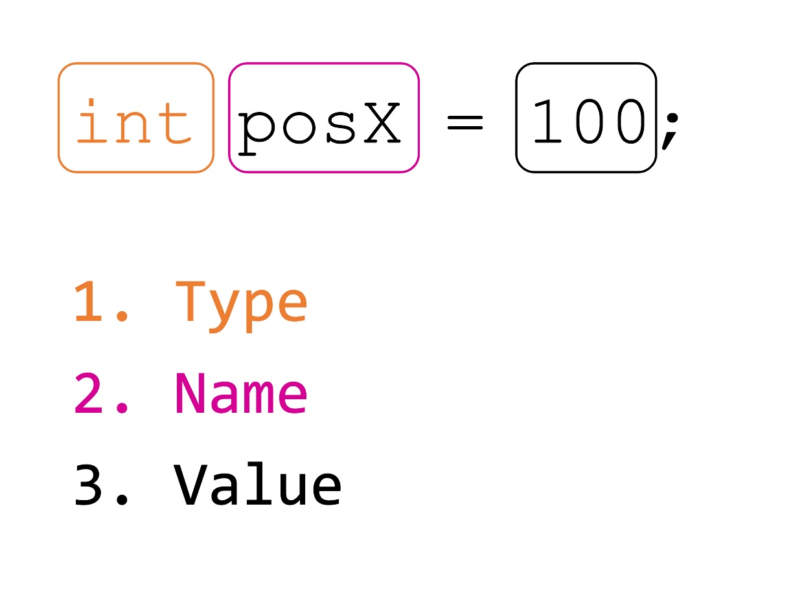
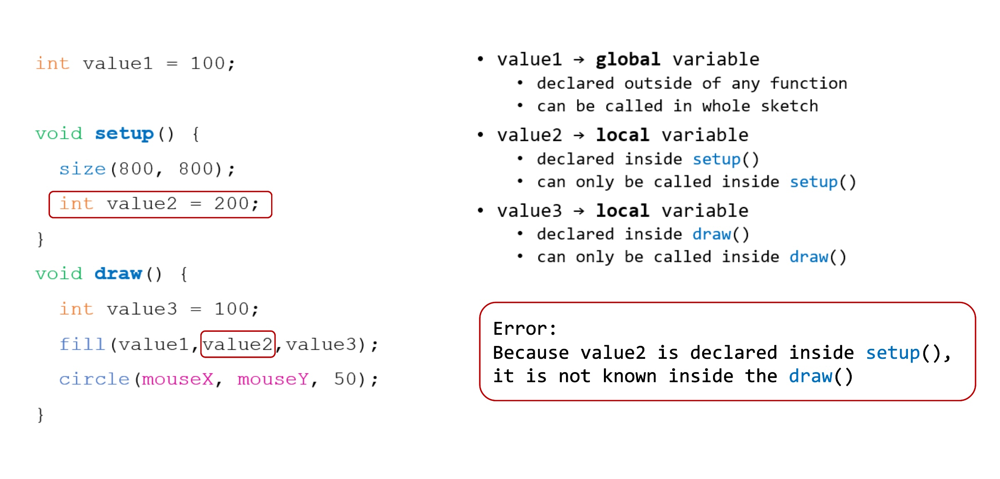
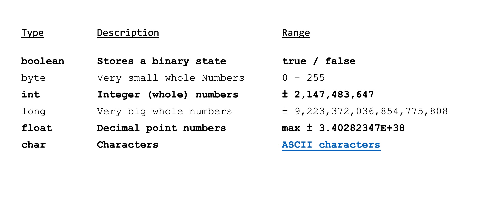
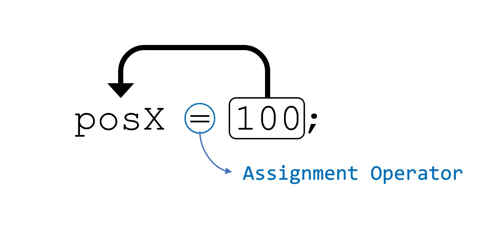
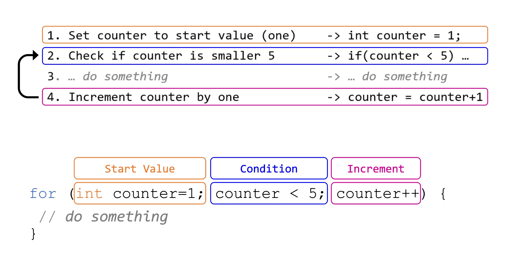
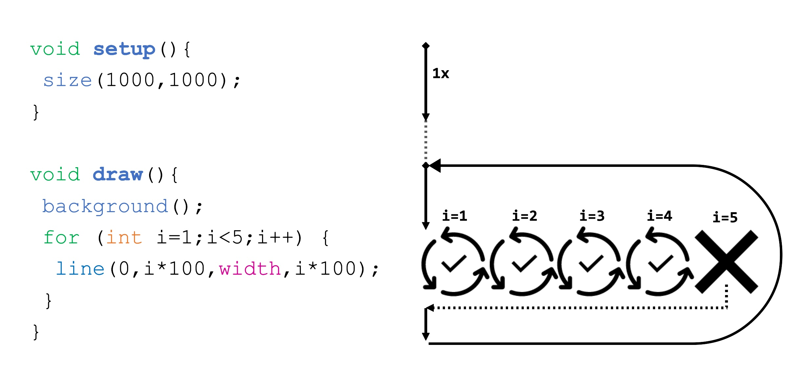
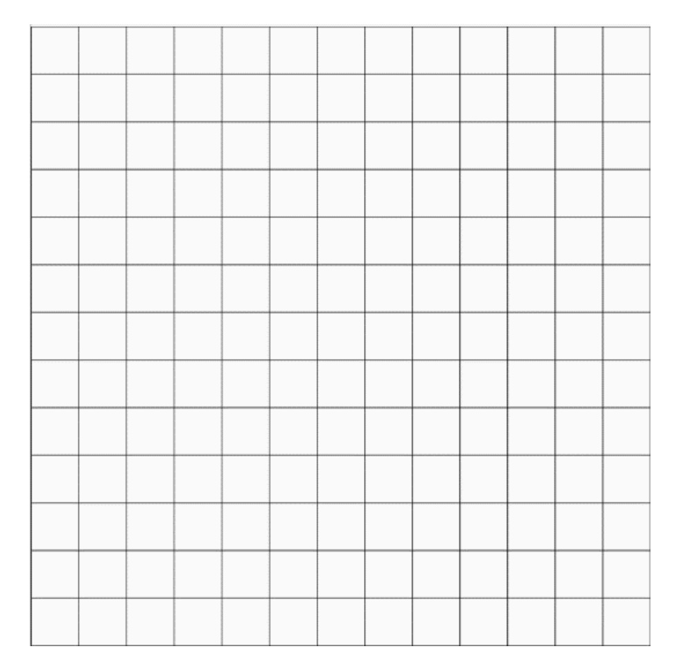

# Session 2 | 17.10.2022 - Context and Syntax

***Disclaimer:*** *This page offers supporting material for an Interaction Design course held at [KISD](https://kisd.de) in the winter term 2022/23. Visit the [landing page](https://github.com/KISDinteractive/fundamentals22w) of this course for more information.*


## 2.1 Origins of the Computer

We started with some content and context about the origins and history of the modern computers we use for programming.

### Counting and Numbers

- **Counting** → important since beginning of humanity. Carving lines into sticks has been used for thousands of years for recording e.g. debts.
- Counting visible things (e.g. with fingers) is simple. Higher numbers and math operations need counting **systems**.
- **Decimal system** was developed in different places and times. Still no positional number system to write down numbers effectively.
- **Hindu-Arabic numerals** (and the positional system), which we know today, spread from India via the Arabic region to Europe. Similar decimal systems also existed in China.
- **Roman numerals** were predominant until a few hundred years ago. They could only be used to write down numbers, but not to perform mathematical operations with them (no pure positional system, but decimal numbers).

### Calculation Machines

- Oldest and most famous is the "**Abacus**". Long before Hindu-Arabic numerals!
- Again, development took place at various places and times. Sometimes connected, sometimes independent. 
- **Why is this of relevance for computers?** For centuries and centuries → the Abacus wasn't just the number one calculating tool but the only one (besides mental arithmetic).
- First mechanical devices around 400 years ago → next chapter

### Mechanical Calculators

- While complex **theorems** were developed in mathematics, the actual calculations were still **performed by hand**.

- Three people are considered as the "the first" and also most inspiring in the field of mechanical calculation devices:
  
  - Wilhelm Schickard (1592-1653)
  - Blaise Pascal (1623-1662)
  - Gottfried Wilhelm von Leibniz (1646-1716)

- All had the same problem: manufacturing of the mechanical parts lacked in precision and longevity → **machines would have worked in theory but got jammed** after a short time.

- Many variants and enhancements in 18th and 19th century without real breakthroughs. 

- **Serial production** in the beginning of the 20th century → availability for science and business, not affordable for home use

- For the **consumer market**, the first affordable calculators became available in the 1970s when electronic calculators from Japanese brands such as Sanyo, Canon, Sharp and Casio entered the market.

- Methods for performing complex math operations on a piece of paper had been introduced over the last centuries as well – we will not go into further detail in the context of this course.

### Electrical Calculators and Logic Machines

- Beginning of 20th century: invention of the **electromagnetic relay** as replacement for mechanical parts for logic operations. 
  
  - Relay technology later got replaced by **vacuum tubes** (1940s), **transistors** (1950s) and **integrated circuits** (end of 1950s).
  
  - Each step reduced **installation space, power consumption and price of parts** and improved their **reliability and longevity**.
  
  - Kickoff for telephone & telegraph technology as well as modern computing machines.

- In the 190's many researched and worked on the development of logic machines with new relay technology. 

- However first programmable computer was the **"Z1" by Konrad Zuse** (1910 – 1995) presented in 1938. 
  
  - Binary and electrically driven
  
  - Though fully mechanical (no relays)
  
  - Programmability through punched colluloid film
  
  - Didn't work reliably because mechanical parts got stuck quickly

- Many consider its further development "**Z3**" (also by **Konrad Zuse**), to be the first *working* (programmable) computer.
  
  - Fully electromechanical 
  
  - 600 Relays for calculating & 1600 Relays for memory
  
  - Like Z1 (and Z2): binary and programmable by punched film
  
  - Unlike Z1 (and Z2): *working* with a clock rate of 5 Hz

- Ongoing discussion and research on the question who build *the first computer*:
  
  - some see *fully electronic* computers (without electro-mechanical parts like relays) as the *first*
  
  - some see computers with *electronic memory* (instead of punch card/films) as the *first*
  
  - ... even more categories
  
  - In the course we investigated some further examples with images
  
  - worth to mention that these advances **roughly went from 1940 to 1950**

### The Human Computer

Excursion about the term "computer" and its previous use for human computers.

- From 17th century on: economical calculations and creating mathematical tables for look ups (like logarithmic scales) were done by humans following explicit rules, but doing the calculation by hand or (in rare cases) on mechanical calculators.

- In the beginning mostly men doing the job, **later on mostly women**: 
  
  - Well educated women were often not enabled to take on visible jobs → so they were doing the highly demanding and complex work in the background in so called "computing rooms".
  
  - Further amplified by the world war (men were drafted for military service) and the accompanying need for calculations.
  
  - Existing experience and knowledge led to the fact that even after the war, **the pioneering era of programming was dominated by women (including black women).**
  
  - In the course we discussed some personal examples of this (Betty Holberton, Mergaret Hamilton, Katherine Johnson)

### Computer Science as a Theoretical Field & Alan Turing

Alan Turing (1912 – 1954)​ was a mathematician. In 1936 he tried to prove a mathematical problem and by doing that came up with the **theoretical model explaining the function of any algorithm and modern computer** called the **Turing Machine**. With his proposition he – kind of unintended / accidentally – founded computer science as a scientific field.

He is most known (outside computer science and theory) for two other things:

- **The Welchman-Turing Bomb** which he was involved in developing.
  
  - developed with a group of scientists and engineers in UK
  
  - succeeded in deciphering the "Enigma-machine" used by German Nazis during World War II
  
  - Some consider this success to be closely linked to the end of the war, brought forward by one or more years, and put the number of lives saved at several million.

- The **Turing Test** or (as he called it) **The Imitation Game**
  
  - thought experiment that should give answers to the question if "a machine can think"
  
  - Setup of the test: an "average" interrogator chats for 5 minutes with a computer and a human being. No voice, no visual contact, just text. If the computer achieves to fool the interrogator in more than 30% into thinking it would be a human being, the test is passed.
  
  - He estimated the test to be passed around 2000. Some already claim to have passed the test, some state that the definition is too loose and instead bring new test setups forward → discussion in the course about today's implications

Story of Alan Turing also includes the shameful discrimination he experienced, which (probably) ended in his death: in 1952, he was arrested for having a homosexual relationship, hindered to work in his field and forced to undergo a so-called "hormone treatment". He was found dead in 1954, probably by suicide. After numerous petitions and the support of famous scientists such as Stephen Hawking, he was officially pardoned by Queen Elizabeth in 2014.


## 2.2 History of Coding Languages

- In the beginning (first computers) programming was done by punch hole cards/film. Often no permanent storage, no/few input and output possibilities.

- Today we have operating systems and plenty of coding languages at hand. Code is stored in permanent storage, entered with keyboard and mouse and revised and executed with a screen.

- Before looking on the different Coding languages: short excursion in the development of modern computers (using transistors and integrated circuits)

### The Modern Computer

- We already got to know the first generations of computers powered by mechanics, relays, tubes and then transistors.

- From 1960 to 1970: many new computers; got smaller; more powerful (due to transistors and ICs). Still huge (minicomputer = size of a fridge)

- Still expensive and mostly for military, science or big businesses. No commercial success for home use

- **1975: Altair 880.** Hosting a microprocessor; smaller (called microcomputer); only about 500 USD.

- **1977: Apple II  (1298 USD):** highly sucessful; more power; 16 color display; video games

- The so called **1977 Trinity** Apple II; Commodore PET 2001; TRS-80

- **1981: IBM PC**. IBM's entry point into home/personal computers. Defined standards. Majority of modern personal computers are derive from the IBM PC.

- **1984: Macintosh 128k** – mouse, graphical user interface

- **1984: Mac OS** and one year later in **1985 Windows 1.0** as the first graphical operating systems.

- After that the only major steps can be considered the invention of commercially successful laptops (**Apple Powerbook 100** in 1991 and **Lenovo ThinkPad 300** in 1992​​) and the invention of functional smartphones with the **Apple iPhone in 2007**.

- In the following years, computer got faster, hosted more storage and memory, needed less power → more about that in the chapter of how a modern computer works.

### Programming Languages

In the course we discussed the profile and use of various languages an their history. Here we will only list the languages with a corresponding "Hello World!" code example (mostly inspired by[ this site](https://excelwithbusiness.com/blogs/news/say-hello-world-in-53-different-programming-languages))

---

**FORTRAN (1955)​: ​

```fortran
program helloworld​  
     print *, "Hello World!"​  
end program helloworld
```

---

##### COBOL (1960):

```cobol
      IDENTIFICATION DIVISION.​
       PROGRAM-ID. hello-world.​
       PROCEDURE DIVISION.​
           DISPLAY "Hello World!"​
           .​
```

---

##### BASIC (1964):

```basic
10 PRINT "Hello World!"​
20 END
```

---

##### Pascal (1970):

```pascal
program HelloWorld(output);​
begin​
  Write('Hello World!')​
end.
```

---

##### C (1972):

```c
#include <stdio.h>​
​
int main(void)​
{​
    printf("Hello World!\n");​
}
```

---

##### C++ (1983):

```cpp
#include <iostream>​
​
int main()​
{​
    std::cout << "Hello World!\n";​
    return 0;​
}
```

---

##### PERL (1987):

```perl
print "Hello World!\n";
```

---

##### Python (1991):

```python
print("Hello World!")​
```

---

##### Visual Basic (1991):

```visual-basic
Sub Main()​

System.Console.WriteLine("Hello World!")​

System.Console.ReadLine()​

End​

End Sub
```

---

##### Ruby (1993):

```ruby
puts 'Hello World!'
```

---

##### Java (1995):

```java
class HelloWorldApp {​
    public static void main(String[] args) {​
        System.out.println("Hello World!"); // Prints the string to the console.​
    }​
}
```

---

##### JavaScript (1995)​:

```javascript
console.log("Hello World!");​
```

---

##### PHP (1995)​:

```php
<?php echo "Hello World!";
```

---

##### C# (2000)​:

```csharp
using System;​
​
class Program​
{​
    static void Main(string[] args)​
    {​
        Console.WriteLine("Hello World!");​
    }​
}
```

---

##### Go (2009)​:

```go
package main​
​
import "fmt"​
​
func main() {​
    fmt.Println("Hello World!")​
}
```

---

##### Swift (2014)​:

```swift
println("Hello World!")
```


## 2.3 Processing

### Transition to Processing

For this session, we used **Processing**, a Java-based framework for creative coding that shares a common history with p5.js.
More on Processing at [https://processing.org/] 

#### Differences in Syntax

The syntax of Processing is quite close to p5.js. Still, in order to migrate our final sketch from the last lesson from p5.js to Processing, we have to make a few adjustments:

```processing
function setup() -> void setup()​

function draw() -> void draw()​

createCanvas() -> size(); ​

mouseIsPressed -> mousePressed
```

The resulting Processing sketch reads as follows:

```processing
void setup() {
  size(800,800);
  background(255);
}

void draw(){
  if (mousePressed == true) {
    fill (mouseX,0,mouseY,50);
  } else {
    fill(255);
  }
  ellipse(mouseX,mouseY,80,80);
}
```


## 2.4 Variables

Variables are one of the most important concetps of programming. In contrast to hard-coded static values, variables are like storage containers, containing data. By refering to the respective container, the contained data can not only be accessed and thus reused multiple times, but can also be manipulated dynamicly.  

### System Variables

Processing comes with a some built-in variables: 

* `mouseX`
  
  * output: horizontal pixel-position of mouse
  * type: int

* `mouseY`
  
  * output: vertical pixel-position of mouse 
  * type: int

* `mousePressed`
  
  * output: true/false
  * type: boolean

* `mouseButton`
  
  * output: 0/LEFT/RIGHT/CENTER
  * type: int

* `keyPressed`
  
  * output: true/false
  * type: boolean

* `key`
  
  * output: character of the last key pressed
  * type: char

* `width`
  
  * output: horizontal pixel-size of canvas
  * type: int

* `height`
  
  * output: vertical picel-size of canvas
  * type: int

* `frameRate`
  
  * output: current framerate
  * type: int

* `frameCount`
  
  * output: amount of frames since start
  * type: int

### User Defined Variables

While system variables can just be called (like in `circle(mouseX,mouseY,50);`), it is possible to create user defined which give more options:

* Declare -> `int posX = 200;` 
* Call -> `circle(posX, mouseY, 50);`
* Control the scope
* Assign & reassign -> `posX = posX+1;`

#### Declaration of Variables

Before a variable can be used, it has to be created. The technical terms for this is _declaration_ and _initialization_ which technically are two things, but most commonly are done together in one line. It is neccessary to define a *type*, a *name* and initilize a *value*
`int posX = 100`



#### Calling

A previously declared variable can be called by using its name
`circle(posX, mouseY, 50);`

#### Scope



#### Variable Types

Refering to the container metaphor, there are different types of containers needed for different types of content.



#### Assign & Reassign

The value of a variable can be manipulated. For this, mostly the Assignment Operator `=` is used. 
`posX=100;`



Example:

```processing
int posX = 100; //declaration
circle(posX, 100, 50); //draw circle at (100,100)
posX = 200; //overwrite current value of posX with 200
circle(posX, 100, 50); //draw circle at (200,100)
```

Important: The Assignment Operator is not a 'equal'-sign as a mathematical concept, indicating a equality between its right and left side. Instead it's taking whatever expression on the right side, and overrides the current value on the left side with it. Thus making it possible incrementing a variable, by reading its current value, adding to it, and updating its value:


Example:

```processing
int posX = 100; //declaration
circle(posX, 100, 50); //draw circle at 100,100
posX = posX+100; //add 100 to current value of posX
circle(posX, 100, 50); //draw circle at 200,100
```

There are multiple ways of incrementing a value.
Example - Incrementing a value by one:

```processing
value = value + 1;
value += 1;
value++;
```

Please note the last option `value++;` and 'value--;` is only useable for incrementing or decrementing by one 

### Task: Stalking Circle

```processing
int posX=0;
int posY=0;

void setup() {
  size(800, 800);
}
void draw () {
  if (mouseX>posX) {
    posX++;
  } else {
    posX--;
  }
  if (mouseY>posY){
    posY++;
  } else {
    posY--;
  }
  circle(posX, posY, 100);
}
```


## 2.5 Loops

Loops are used in order to execute similar sets of instructions for a defined number of time. 



Example: Drawing 4 lines

without a for-loop:

```processing
void draw(){​
line(0,100,width,100);​
line(0,200,width,200);​
line(0,300,width,300);​
line(0,400,width,400);​
}
```

with a for-loop:

```processing
void draw(){
for (int i=1;i<5;i++) {
 line(0,i*100,width,i*100);
}​
```

The counter-variable (mostly being named 'i') can be used also inside the loop as a parameter for its functions, thus drawing the lines a different coordinates each.



### Task: Grid

```processing
void setup() {​
  size(800, 800);​
  background(250);​
}​
void draw() {​
  int interval= 60;​
  int amount= 20;​  
​
  for (int posX = 0; posX<amount; posX++) {​
    line(posX*interval, 0, posX*interval, height);​
  }​
  for (int posY = 0; posY<amount; posY++) {​
    line(0, posY*interval, width, posY*interval);​
  }​
}
```


