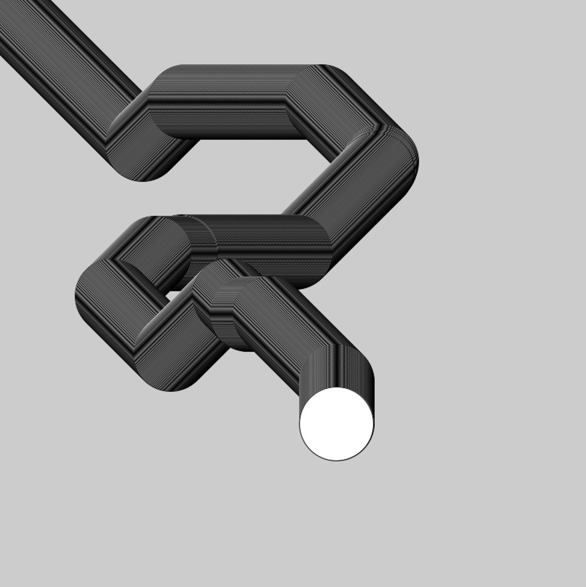
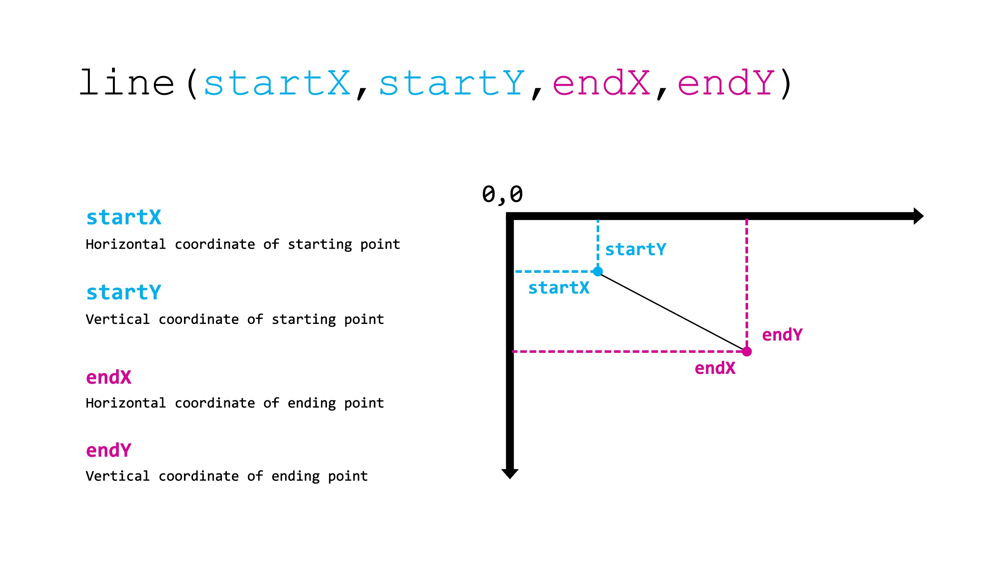

# Session 2 | 17.10.2022 - Context and Syntax

***Disclaimer:*** *This page offers supporting material for an Interaction Design course held at [KISD](https://kisd.de) in the winter term 2022/23. Visit the [landing page](https://github.com/KISDinteractive/fundamentals22w) of this course for more information.*

## 2.1 Origins of the Computer

We started with some content and context about the origins and history of the modern computers we use for programming.

### Counting and Numbers

- **Counting** → Important since the beginning of humanity. Carving lines into sticks has been used for thousands of years to record debts, for example.
- Counting visible things (e.g. with your fingers) is easy. Higher numbers and mathematical operations require counting **systems**.
- The **decimal system** has been developed in different places and times. Still no positional number system to write numbers effectively.
- The **Hindu-Arabic numerals** (and positional system) that we know today spread from India through the Arabic region to Europe. Similar decimal systems also existed in China.
- Roman numerals predominated until a few hundred years ago. They could only be used to write down numbers, not to perform mathematical operations with them (not a pure positional system, but decimal numbers).

### Calculation Machines

- The oldest and most famous is the **Abacus**. Long before Hindu-Arabic numerals!
- Again, development took place in different places and times. Sometimes related, sometimes independent. 
- Why is this relevant to computers?** For centuries and centuries the Abacus wasn't just the most important tool for calculating, it was the only one (apart from mental arithmetic).
- First mechanical devices about 400 years ago → next chapter

### Mechanical Calculators

- While complex **theorems** were being developed in mathematics, the actual calculations were still **done by hand**.

- Three people are considered to be "the first" and most inspiring in the field of mechanical calculating machines:
  - Wilhelm Schickard (1592-1653)
  - Blaise Pascal (1623-1662)
  - Gottfried Wilhelm von Leibniz (1646-1716)
- They all had the same problem: the manufacturing of the mechanical parts lacked precision and longevity → **the machines worked in theory, but jammed after a short time**.

- Many variations and improvements in the 18th and 19th centuries without any real breakthrough. 
- **Serial production** in the early 20th century → availability for science and business, not affordable for home use

- For the **consumer market**, the first affordable calculators became available in the 1970s, when electronic calculators from Japanese brands such as Sanyo, Canon, Sharp and Casio entered the market.

- Methods of performing complex mathematical operations on a piece of paper had also been introduced in the previous centuries - we will not go into detail in this course.

### Electrical Calculators and Logic Machines

- Early 20th century: invention of the **electromagnetic relay** to replace mechanical parts for logic operations. 

  - Relay technology was later replaced by **vacuum tubes** (1940s), **transistors** (1950s) and **integrated circuits** (late 1950s).

  - Each step reduced **package size, power consumption and component price** and improved their **reliability and longevity**.

  - Kick-off for telephone & telegraph technology and modern computers.

- In the 190s, many people researched and worked on the development of logic machines using new relay technology. 

- However, the first programmable computer was the **"Z1" by Konrad Zuse (1910 - 1995), presented in 1938. 

  - Binary and electric

  - Although fully mechanical (no relays)

  - Programmable by punched colluloid film

  - Didn't work reliably because mechanical parts quickly jammed

- Many consider its successor "**Z3**" (also by **Konrad Zuse**), to be the first *working* (programmable) computer.

  - Fully electromechanical 

  - 600 relays for calculation & 1600 relays for storage

  - Like Z1 (and Z2): binary and programmable by punched film

  - Unlike Z1 (and Z2): *operates* at a clock rate of 5 Hz

- Ongoing discussion and research on the question who built *the first computer*:

  - some see *fully electronic* computers (without electromechanical parts like relays) as the *first*

  - some see computers with *electronic memory* (instead of punch card/film) as the *first*

  - ... even more categories

  - In the course we have examined some other examples with pictures.

    - It is worth noting that these advances occurred **roughly from 1940 to 1950**.

### The Human Computer

Excursus on the term "computer" and its previous use for human computers.

- From the 17th century: economic calculations and the creation of mathematical tables for reference (such as logarithmic scales) were done by people following explicit rules, but doing the calculations by hand or (in rare cases) on mechanical calculators.

- In the beginning it was mostly men who did this work, **later mostly women**: 

  - Well-educated women were often unable to take on visible jobs → so they did the highly demanding and complex work in the background in so-called "computing rooms".

- This was exacerbated by the Second World War (men were called up for military service) and the resulting need for calculations.

  - The experience and knowledge available meant that even after the war, the pioneering era of programming was dominated by women (including black women).

  - In the course we discussed some personal examples of this (Betty Holberton, Mergaret Hamilton, Katherine Johnson).

### Computer Science as a Theoretical Field & Alan Turing

Alan Turing (1912 - 1954) was a mathematician. In 1936, while trying to prove a mathematical problem, he came up with the **theoretical model that explains the function of any algorithm and modern computer**, called the **Turing machine**. With this proposition, he - unintentionally / accidentally - founded computer science as a scientific field.

He is best known (outside of computer science and theory) for two other things:

- **The Welchman-Turing Bomb**, which he helped to develop.

  - developed with a group of scientists and engineers in the UK

  - the success in cracking the "Enigma" machine used by the German Nazis during the Second World War.

  - Some consider this success to be closely linked to the end of the war, brought forward by one or more years, and put the number of lives saved at several million.

- The **Turing Test** or (as he called it) **The Imitation Game** thought experiment

  - Thought experiment designed to answer the question of whether "a machine can think".

  - Structure of the test: an "average" interrogator chats with a computer and a human for 5 minutes. No voice, no eye contact, just text. If the computer manages to fool the interrogator into thinking it was a human being more than 30% of the time, the test is passed.

  - He estimates that the test will be passed around the year 2000. Some claim to have passed the test today, others claim that the definition is too loose and propose new test setups instead → Discussion in the course about today's implications

The story of Alan Turing also includes the shameful discrimination he experienced, which (probably) ended in his death: in 1952 he was arrested for having a homosexual relationship, prevented from working in his field and forced to undergo so-called "hormone treatment". He was found dead in 1954, presumably by suicide. After numerous petitions and the support of famous scientists such as Stephen Hawking, he was officially pardoned by Queen Elizabeth in 2014.

## 2.2 History of Coding Languages

- In the beginning (first computers) programming was done with punched cards/film. Often no permanent storage, no/few input and output options.

- Today we have operating systems and many programming languages. Code is stored in permanent memory, entered with a keyboard and mouse and revised and executed on a screen.

- Before we look at the different programming languages, let us take a brief look at the development of modern computers (using transistors and integrated circuits).

### The Modern Computer

- We have already seen the first generations of computers powered by mechanics, relays, tubes and then transistors.

- From 1960 to 1970: many new computers; became smaller; more powerful (due to transistors and ICs). Still huge (minicomputer = size of a fridge)

- Still expensive and mostly for military, science or large companies. No commercial success for home use

- **1975: Altair 880.** Contains a microprocessor; smaller (called microcomputer); only about 500 USD.

- **1977: Apple II  (1298 USD):** Very successful; more power; 16 colour display; video games

- The so called **1977 Trinity** Apple II; Commodore PET 2001; TRS-80

- **1981: IBM PC**. IBM's entry point into home/personal computing. Defined standards. Majority of modern personal computers are derived from the IBM PC.

- **1984: Macintosh 128k** – Mouse, graphical user interface

- **1984: Mac OS** and one year later in **1985 Windows 1.0** as the first graphical operating systems.

- After that the only major steps can be seen as the invention of commercially successful laptops (**Apple Powerbook 100** in 1991 and **Lenovo ThinkPad 300** in 1992​​) and the invention of functional smartphones with the **Apple iPhone in 2007**.

- In the years that followed, computers became faster, had more memory and storage, and used less power → more about this in the chapter on how a modern computer works.

### Programming Languages

In the course we discussed the profile and use of different languages and their history. Here we will only list the languages with a corresponding "Hello World!" code example (mostly inspired by[ this site](https://excelwithbusiness.com/blogs/news/say-hello-world-in-53-different-programming-languages)).

---

#### FORTRAN (1955): ​

```fortran
program helloworld​  
     print *, "Hello World!"​  
end program helloworld
```

---

#### COBOL (1960):

```cobol
      IDENTIFICATION DIVISION.​
       PROGRAM-ID. hello-world.​
       PROCEDURE DIVISION.​
           DISPLAY "Hello World!"​
           .​
```

---

#### BASIC (1964):

```basic
10 PRINT "Hello World!"​
20 END
```

---

#### Pascal (1970):

```pascal
program HelloWorld(output);​
begin​
  Write('Hello World!')​
end.
```

---

#### C (1972):

```c
#include <stdio.h>​
​
int main(void)​
{​
    printf("Hello World!\n");​
}
```

---

#### C++ (1983):

```cpp
#include <iostream>​
​
int main()​
{​
    std::cout << "Hello World!\n";​
    return 0;​
}
```

---

#### PERL (1987):

```perl
print "Hello World!\n";
```

---

#### Python (1991):

```python
print("Hello World!")​
```

---

#### Visual Basic (1991):

```visual-basic
Sub Main()​

System.Console.WriteLine("Hello World!")​

System.Console.ReadLine()​

End​

End Sub
```

---

#### Ruby (1993):

```ruby
puts 'Hello World!'
```

---

#### Java (1995):

```java
class HelloWorldApp {​
    public static void main(String[] args) {​
        System.out.println("Hello World!"); // Prints the string to the console.​
    }​
}
```

---

#### JavaScript (1995):

```javascript
console.log("Hello World!");​
```

---

#### PHP (1995):

```php
<?php echo "Hello World!";
```

---

#### C# (2000):

```csharp
using System;​
​
class Program​
{​
    static void Main(string[] args)​
    {​
        Console.WriteLine("Hello World!");​
    }​
}
```

---

#### Go (2009):

```go
package main​
​
import "fmt"​
​
func main() {​
    fmt.Println("Hello World!")​
}
```

---

#### Swift (2014):

```swift
println("Hello World!")
```

## 2.3 Processing

### Transition to Processing

For this session, we used **Processing**, a Java-based framework for creative coding that shares a common history with [p5.js](https://p5js.org). More about [Processing](https://processing.org/])

#### Differences in Syntax

The syntax of Processing is quite close to p5.js. However, in order to migrate our final sketch from the last lesson from p5.js to Processing, we need to make a few adjustments:

```processing
function setup() → void setup()​

function draw() → void draw()​

createCanvas() → size(); ​

mouseIsPressed → mousePressed
```

The resulting Processing sketch reads as follows: [Link to Code File](src/Code1_Transition_To_Processing/Code1_Transition_To_Processing.pde)

```processing
void setup() {
  size(800,800);
  background(255);
}

void draw(){
  if (mousePressed == true) {
    fill (mouseX,0,mouseY,50);
  } else {
    fill(255);
  }
  ellipse(mouseX,mouseY,80,80);
}
```

## 2.4 Variables

Variables are one of the most important concepts in programming. Unlike hard-coded static values, variables are like storage containers that hold data. By referencing the container, you can not only access and reuse the data it contains, but also manipulate it dynamically.

### System Variables

Processing comes with a some built-in variables: 

* `mouseX` *(int)*: horizontal pixel-position of mouse

* `mouseY` *(int)*: vertical pixel-position of mouse 

* `mousePressed` *(boolean)*: true/false

* `mouseButton` *(int)*: 0/LEFT/RIGHT/CENTER

* `keyPressed` *(boolean)*: true/false

* `key` *(char)*: character of the last key pressed

* `width` *(int)*: horizontal pixel-size of canvas

* `height` *(int)*: vertical pixel-size of canvas

* `frameRate` *(int)*: current framerate

* `frameCount` *(int)*: amount of frames since start

### User Defined Variables

While system variables can just be called (like in `circle(mouseX,mouseY,50);`), it is possible to create user defined which give more options:

* Create (declare and initiate) → `int posX = 200;` 
* Call → `circle(posX, mouseY, 50);`
* Control the scope
* Assign & reassign → `posX = posX+1;`

#### Creation of Variables

Before a variable can be used, it must be created. The technical terms for this are _declaration_ and _initialization_ which are technically two things, but usually are done together in one line. It is necessary to define a *type*, a *name* and initialise a *value*
`int posX = 100`


#### Calling

A previously declared variable can be accessed by using its name

```processing
circle(posX, mouseY, 50);
```

#### Scope

Variables have a limited "scope". If created outside all functions (like `setup()` and `draw()`) like `variable1` they are **global** and can be called from everywhere. When created inside of functions, they are only accessible inside of that function. See also the slide:


#### Variable Types

Using the container metaphor, there are different types of containers needed for different types of content. In Processing we usually use these (**bold** for the most important):


#### Assign & Reassign

The value of a variable can be changed/manipulated. For this, mostly the Assignment Operator `=` is used: 

```processing
posX=100;
```


**Example:**

```processing
int posX = 100; //declaration
circle(posX, 100, 50); //draw circle at (100,100)
posX = 200; //overwrite current value of posX with 200
circle(posX, 100, 50); //draw circle at (200,100)
```

**Note:** The Assignment Operator is not a 'equal'-sign as a mathematical concept, indicating a equality between its right and left side. Instead it's taking whatever expression on the **right side**, and overrides the current value on the **left side** with it. Thus making it possible incrementing a variable, by reading its current value, adding to it, and updating its value, like so:


**Example:**

```processing
int posX = 100; //declaration
circle(posX, 100, 50); //draw circle at 100,100
posX = posX+100; //add 100 to current value of posX
circle(posX, 100, 50); //draw circle at 200,100
```

There are several ways to increment a value.

**Example - Incrementing a value by one:**

```processing
value = value + 1;
value += 1;
value++;
```

Please note the last option `value++;` and `value--;` is only useable for incrementing or decrementing **by one **.

### Task: Stalking Circle

All participants had to come up with a circle that follows the mouse pointer in a smooth animation:


**Solution:** [Link to Code File](src/Code2_Stalking_Circle/Code2_Stalking_Circle.pde)

```processing
int posX=0;
int posY=0;

void setup() {
  size(800, 800);
}
void draw () {
  //Follow the mouse vertically
  if (mouseX>posX) {
    posX++; //go down, if mouse is lower than circle
  } else {
    posX--; //go up, if mouse is higher than circle
  }
  //Follow the mouse horizontally
  if (mouseY>posY) {
    posY++;  //go right, if mouse is right of circle
  } else {
    posY--;  //go left, if mouse is left of circle
  }
  //draw circle
  circle(posX, posY, 100);
}
```

## 2.5 Loops

Loops are used to execute similar sets of instructions a specified number of times. We learned to use the most common one – the **for loop:**


**Example: Drawing 4 lines**

without a for-loop:

```processing
void draw(){​
line(0,100,width,100);​
line(0,200,width,200);​
line(0,300,width,300);​
line(0,400,width,400);​
}
```

with a for-loop:

```processing
void draw(){
for (int i=1;i<5;i++) {
 line(0,i*100,width,i*100);
}​
```

The counter-variable (mostly being named 'i') can be used also inside the loop as a parameter for its functions, thus drawing the lines a different coordinates each.


### Task: Grid

Last task for the day was to create a grid like this: 


For this we used the newly learned `for()` loop and the `line()` instruction:



**Solution:** [Link to Code File](src/Code3_Draw_Grid/Code3_Draw_Grid.pde)

```processing
void setup() {
  size(800, 800);
  background(250);
}
void draw() {
  int interval= 60;  //distance between each line
  int amount= 20;    //number of lines to be drawn

  //draw vertical lines from left to right
  for (int posX = 0; posX<amount; posX++) {
    line(posX*interval, 0, posX*interval, height);
  }

  //draw horizontal lines from top to bottom
  for (int posY = 0; posY<amount; posY++) {
    line(0, posY*interval, width, posY*interval);
  }
}
```
