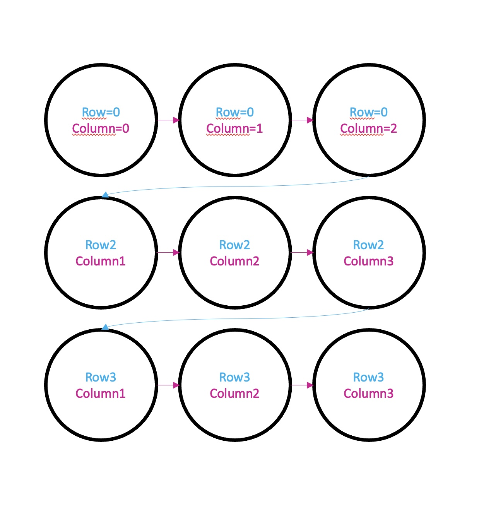

# Session 3 | 24.10.2022 - Advanced Code

***Disclaimer:*** *This page offers supporting material for an Interaction Design course held at [KISD](https://kisd.de) in the winter term 2022/23. Visit the [landing page](https://github.com/KISDinteractive/fundamentals22w) of this course for more information.*

**Links for the Session**

- [We started this session with the code of the previous one](src/Code1_grid/Code1_grid.pde)

## 2.5 Closing of Previous Loops-Session

We didn't close the previous session about loops, so here you go:

### for-loop vs. while loop

We've learned how to use the for-loop. There is a second type of loop, the **while-loop**, that doesbasically the same thing. Here are some differences and the implementation:


### Nested Loops

Lastly, we looked at the concept of nested loops. How could we generate something like this (called a "matrix" of circles)?

**Target:**


Using two regular for-loops would only result in a vertical and horizontal array of circles:


Let's imagine the *matrix* consists of 3 x 3 elements. We could split it up in:



We can achieve that by creating **a for-loop for iterating through the columns that is nested inside a for-loop iterating through the rows:**


So the final code for nested loops goes like this ([link to code file](src/Code2_NestedLoops/Code2_NestedLoops.pde)):

```processing
int interval= 60; //how much space (in pixels) between lines?
int amount= 20;   //how many lines?

void setup() {
  size(800, 800);
  background(255);
}

void draw() {  
  //iterate through rows
  for (int row = 0; row<amount; row++) {
    //iterate through columns
    for (int column = 0; column<amount; column++) {
      circle(column*interval, row*interval, 50);
    }
  }
}
```


## 3.1 Arrays

Arrays are in general arrangements / sequences of things

You can think of them as a freight train of shipping containers, as we used to think of them when we learned that variables are a container that holds data of a certain type. Arrays and our metaphoric trian have much in common:

- The **train** has **many wagons**** of the **same type** (e.g. shipping container) in a **fixed order.**

- An **array** has **many elements** of the **same type** (e.g. int variables) in a **fixed order.**


Before we had to name each variable with a unique name. In an array we can access/manipulate them by using the **array name** and their **position (called "index")** in the array:


### "Create" Arrays

We can "create" (declare & initalize to be precise) arrays by doing:

```processing
int[] posY = {0,100,200,300,400};
```


There are other ways of "creating" arrays, that you can look up in the syntax!

### "Use" Arrays

We can "use" (call & assign to be precise) arrays in a similar way than variables. Call the 4th element of an array for instance (array always start to count at 0, so the 4th element is index number 3):

```processing
if (posY[3]>whatever){ ...
```

The same way we can (re-)assign values:

```processing
posY[3] = 100;
```


### Multidimensional Arrays

With the train metaphor we learned a so-called one dimensional array, as it stores only a single row of elements.

There can also be 

- two dimensional arrays (imagine a train with two floors of containers
- three dimensional arrays (Imagine a container shiff that stores containers not only one behind the other and on top of each other, but also side by side)
- arrays with more than three dimensions (difficult to imagine, used in higher level concepts and in math)

An examplary assignment using a 2D array would look like this: 

```processing
posY[1][3] = 100;
```

Check out the Processing documentation for more information!


### Falling Blobs

In the course we wrote a sketch that creates 5 blobs that fall "down" the screen at different speeds and with different starting positions. Here is the final code ([link to code file](src/Code4_FallingBlobs/Code4_FallingBlobs.pde)):

```processing
int[] posY = {0, 100, 200, 300, 400}; //starting position of 5 blobs
int[] speeds = {1, 2, 3, 4, 5};       //speed of 5 blobs

void setup() {
  size(800, 800);
}

void draw() {
  //styling stuff
  background(255);
  fill(0);

  for (int i = 0; i < 5; i = i+1) {
    //increment position of current (i) blob by adding "speeds"
    posY[i] = posY[i] + speeds[i];

    //draw current (i) circle with corresponding posY
    circle (i*150, posY[i], 50);
    
    //set back at the end of the screen
    if (posY[i] > height) {
      posY[i]=0;
    }
  }
}
```


## 3.2 Binary Numbers

## 3.3 Binary Data & Machines (and Punchcards)

## 3.4 Modern Computers

## 3.5 Functions and Classes


**Special:** you could also solve the Task by using point() only. The result would look [like this (code file)](src/Code_5_myRect_alternativeVersionUsingPoints/Code_5_myRect_alternativeVersionUsingPoints.pde).

