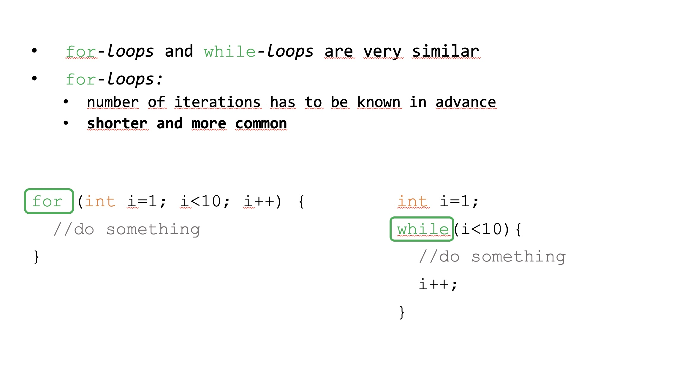
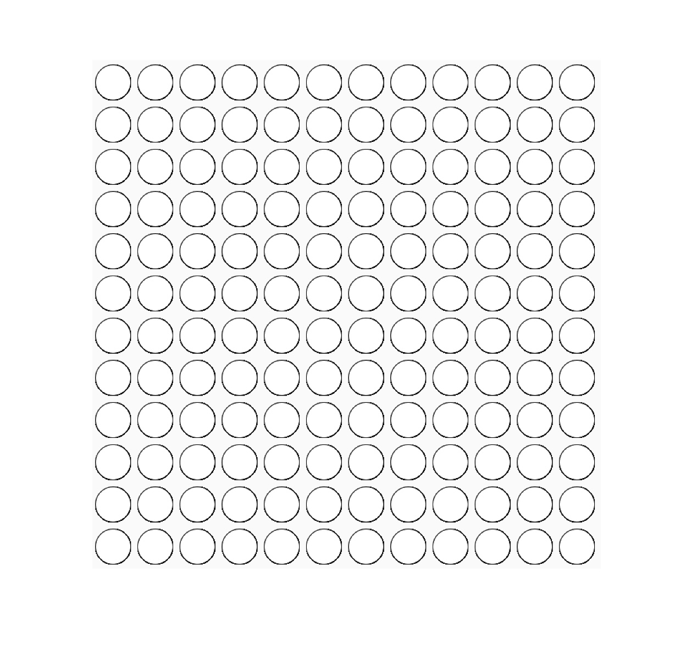
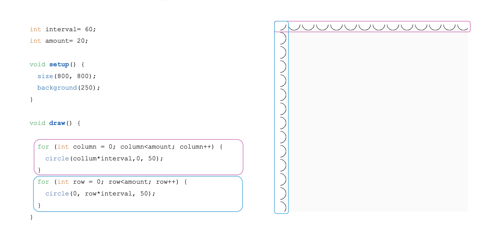
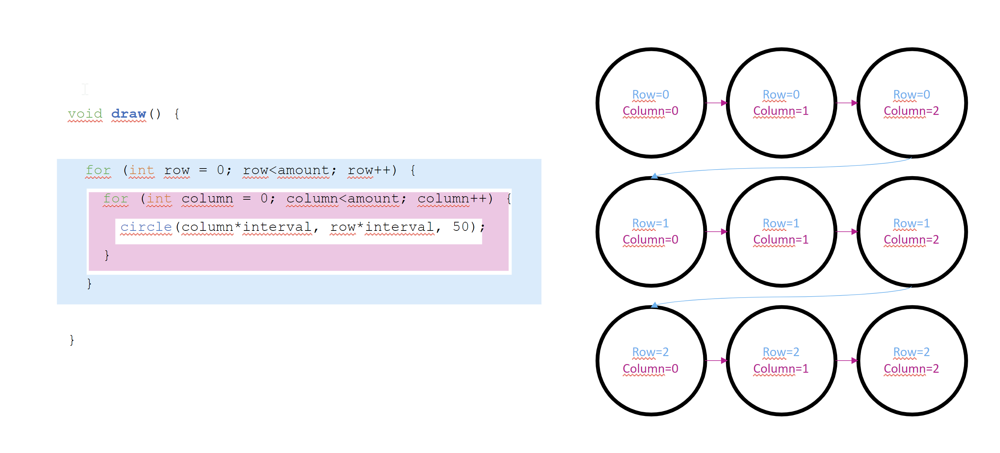
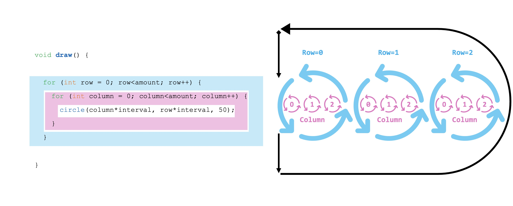
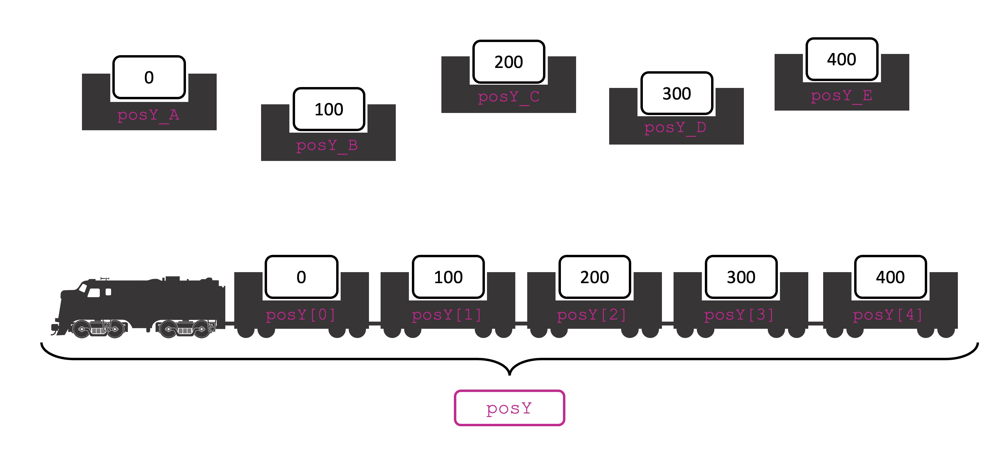
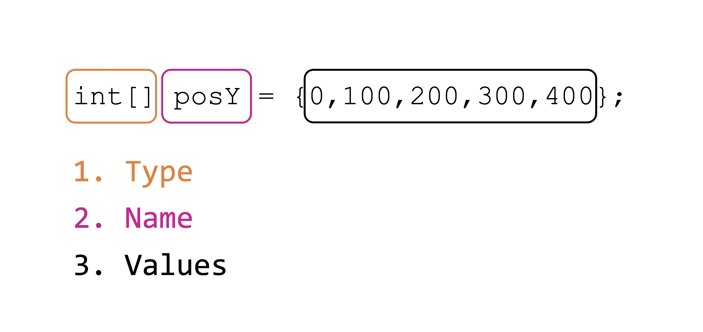
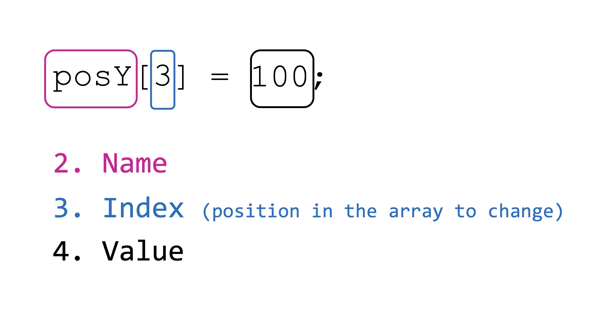
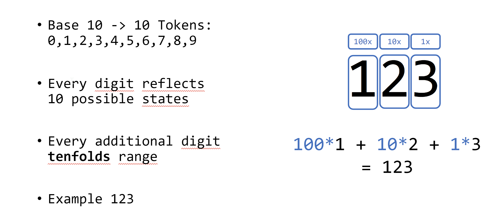
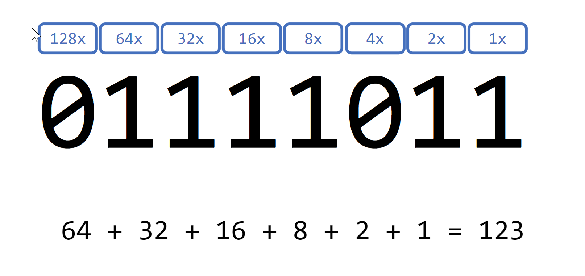

# Session 3 | 24.10.2022 - Advanced Code

***Disclaimer:*** *This page offers supporting material for an Interaction Design course held at [KISD](https://kisd.de) in the winter term 2022/23. Visit the [landing page](https://github.com/KISDinteractive/fundamentals22w) of this course for more information.*

**Links for the Session**

- [We started this session with the code of the previous one](src/Code1_grid/Code1_grid.pde)

## 2.5 Closing of Previous Loops-Session

We didn't close the previous session about loops, so here you go:

### for-loop vs. while loop

We've learned how to use the for-loop. There is a second type of loop, the **while-loop**, that doesbasically the same thing. Here are some differences and the implementation:




### Nested Loops

Lastly, we looked at the concept of nested loops. How could we generate something like this (called a "matrix" of circles)?

**Target:**




Using two regular for-loops would only result in a vertical and horizontal array of circles:




Let's imagine the *matrix* consists of 3 x 3 elements. We could split it up in:



We can achieve that by creating **a for-loop for iterating through the columns that is nested inside a for-loop iterating through the rows:**




So the final code for nested loops goes like this ([link to code file](src/Code2_NestedLoops/Code2_NestedLoops.pde)):

```processing
int interval= 60; //how much space (in pixels) between lines?
int amount= 20;   //how many lines?

void setup() {
  size(800, 800);
  background(255);
}

void draw() {  
  //iterate through rows
  for (int row = 0; row<amount; row++) {
    //iterate through columns
    for (int column = 0; column<amount; column++) {
      circle(column*interval, row*interval, 50);
    }
  }
}
```


## 3.1 Arrays

Arrays are in general arrangements / sequences of things

You can think of them as a freight train of shipping containers, as we used to think of them when we learned that variables are a container that holds data of a certain type. Arrays and our metaphoric trian have much in common:

- The **train** has **many wagons**** of the **same type** (e.g. shipping container) in a **fixed order.**

- An **array** has **many elements** of the **same type** (e.g. int variables) in a **fixed order.**


Before we had to name each variable with a unique name. In an array we can access/manipulate them by using the **array name** and their **position (called "index")** in the array:




### "Create" Arrays

We can "create" (declare & initalize to be precise) arrays by doing:

```processing
int[] posY = {0,100,200,300,400};
```



There are other ways of "creating" arrays, that you can look up in the syntax!

### "Use" Arrays

We can "use" (call & assign to be precise) arrays in a similar way than variables. Call the 4th element of an array for instance (array always start to count at 0, so the 4th element is index number 3):

```processing
if (posY[3]>whatever){ ...
```

The same way we can (re-)assign values:

```processing
posY[3] = 100;
```




### Multidimensional Arrays

With the train metaphor we learned a so-called one dimensional array, as it stores only a single row of elements.

There can also be 

- two dimensional arrays (imagine a train with two floors of containers
- three dimensional arrays (Imagine a container shiff that stores containers not only one behind the other and on top of each other, but also side by side)
- arrays with more than three dimensions (difficult to imagine, used in higher level concepts and in math)

An examplary assignment using a 2D array would look like this: 

```processing
posY[1][3] = 100;
```

Check out the Processing documentation for more information!


### Falling Blobs

In the course we wrote a sketch that creates 5 blobs that fall "down" the screen at different speeds and with different starting positions. Here is the final code ([link to code file](src/Code4_FallingBlobs/Code4_FallingBlobs.pde)):

```processing
int[] posY = {0, 100, 200, 300, 400}; //starting position of 5 blobs
int[] speeds = {1, 2, 3, 4, 5};       //speed of 5 blobs

void setup() {
  size(800, 800);
}

void draw() {
  //styling stuff
  background(255);
  fill(0);

  for (int i = 0; i < 5; i = i+1) {
    //increment position of current (i) blob by adding "speeds"
    posY[i] = posY[i] + speeds[i];

    //draw current (i) circle with corresponding posY
    circle (i*150, posY[i], 50);
    
    //set back at the end of the screen
    if (posY[i] > height) {
      posY[i]=0;
    }
  }
}
```


## 3.2 Binary Numbers
### Understanding the Numeral Systems
The Decimal System, used by most modern civilizations to represent numbers and do math with them, is just one of an infinite amout of numeral systems, which all follow the same internal logic, and most naturally can be explained thorugh the Decimal System:
- Numeral Systems have a **base**, which represent the amout of tokens (or states) a digit is allow to have. _In Decimal there are **ten** tokens: 0, 1, 2, ,3 ,4 ,5, 6, 7, 8, 9_
- Counting up works by iterating through the tokens _( 0 -> 1 -> 2 -> 3 ... )_ until the last token is reached _(9)_
- In order to count higher than the token with the highest value, two things have to happen:
  - the current digit is reset to Zero
  - at the same time, either a new digit is introduced to the left - or an already existing digit on the left is incremented by one
- Following this logic, every new digit introducted extends the possible values represented by the factor of the base ( = amount of tokens). _In Decimal this means, every new digit **tenfolds** the possible values represented by the numeral system_
- As a consequence, counting from right, every digits value is multiplied with incremental expoents of the base, starting with one. _In Decimal this means, the value of the digit on the farest right is multiplied with 1, the digit left of that is multiplied with 10, the digit to the left of that is multiplied with 100 etc._

So for exampple, the number '123' or 'onehundred-and-twenty-three' in the decimal system is represented as 1 * 100 + 2 * 10 + 3 * 1




### The Binary System
The Binary System is a numeral system with a base of **two**. Thus every digit is only able two represent on of two states: **0** or **1**. The Binary system follows exactly the same inner logic, as all other numeral systems, and was very important for the development of machine based calculation and comptuing. Since every new digit only **doubles** the possible values represented, a number represented in the binary systems takes more digits than the same number represented in decimal. Counting up from 0 to 9 in the Binary System produces the following numbers:

0 -> 0

1 -> 1

2 -> 10

3 -> 11

4 -> 100

5 -> 101

6 -> 110

7 -> 111

8 -> 1000

9 -> 1001


A digit in binary is refered to as a **Bit** and is the smallest chunk of information in Computer Science, it can only hold a **0** or **1**, respectively an **on** or **off**. 
Very commonly Bits are organized as groups of 8, which are also called a **Byte**. Holding 8 Bits, a Byte by itself is able to hold values between 0 and 255. Thus, the Example from before '123' can be represented as **01111011**



There were reasons, why early and present computation is utilzing binary numbers under the hood. 
- It is possible to perform normal mathematical operations in binary, because the inner logic of numeral systems still persists. This means math still works as normal.

- There is a field of mathematics called _Boolean Algebra_, which is specialized to formalize logical statements as binary **true** or **false** expressions.

- It is relativly easy to represent and to read out only two states, much easier than to differenciate 10 nuances of a state for a direct projection of the decimal system. This 'robustness' made it possible to represent and read out binary information through many technologies like punchcards, relais, vaccum tubes and transistors - it is just necessary to differenciate between 2 states, 1/0, on/off, present/missing, high/low.  

## 3.3 Binary Data & Machines (and Punchcards)

## 3.4 Modern Computers

## 3.5 Functions and Classes


**Special:** you could also solve the Task by using point() only. The result would look [like this (code file)](src/Code_5_myRect_alternativeVersionUsingPoints/Code_5_myRect_alternativeVersionUsingPoints.pde).

