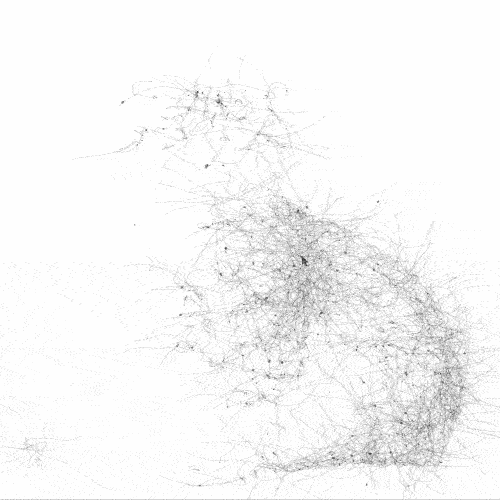
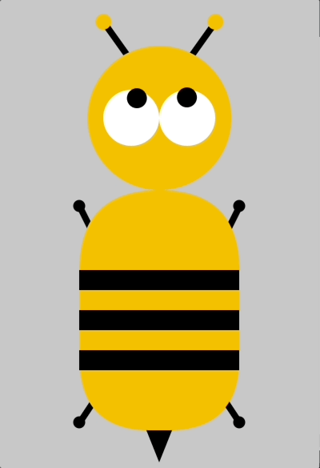
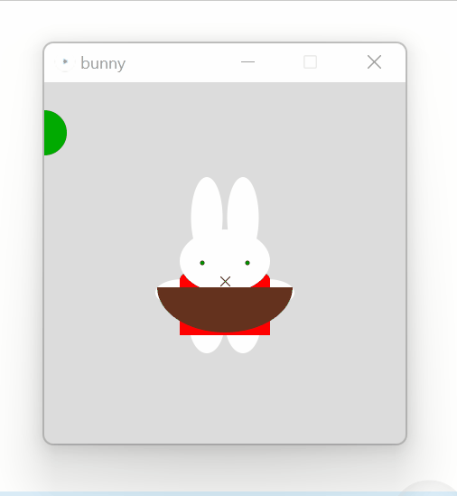
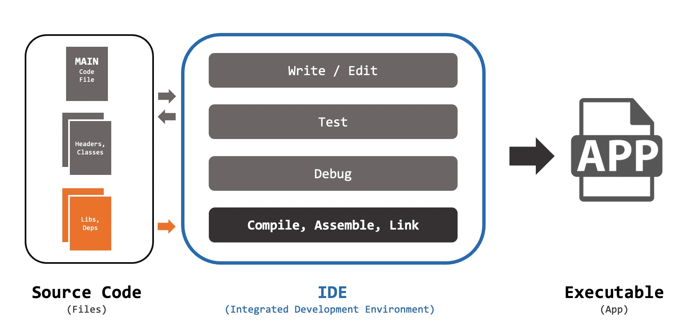
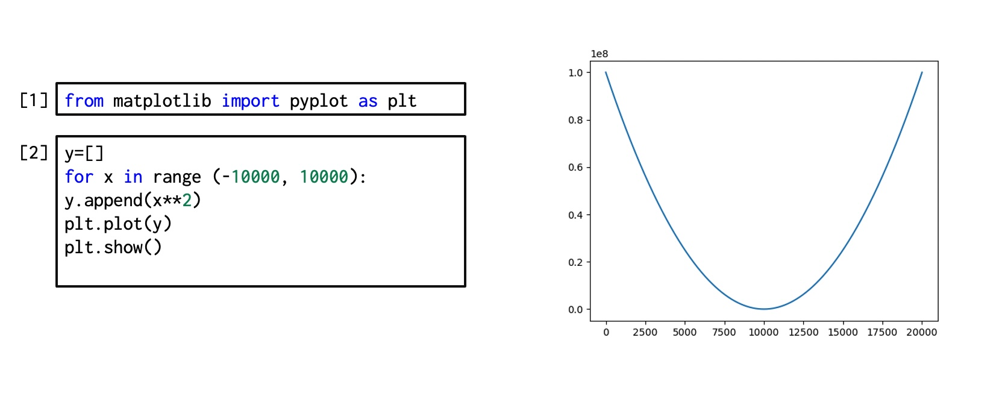
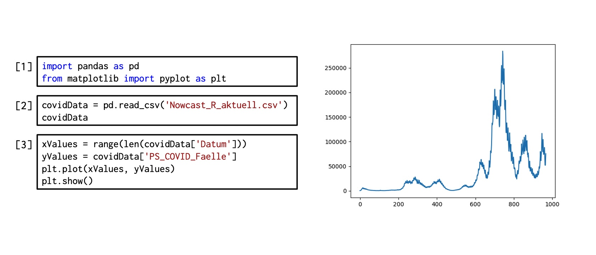

# Session 4 | 31.10.2022 - Application and other languages

***Disclaimer:*** *This page offers supporting material for an Interaction Design course held at [KISD](https://kisd.de) in the winter term 2022/23. Visit the [landing page](https://github.com/KISDinteractive/fundamentals22w) of this course for more information.*

## 4.1 Application: Creature 2.0

In the first 90 minutes of session 4, we applied what we had learned so far: the participants were asked to animate their creatures from the first session or make them interactive to practice using code.

|                                                              |                                                              |                                                              |
| ------------------------------------------------------------ | ------------------------------------------------------------ | ------------------------------------------------------------ |
|  |  |  |
|  |  |  |
|  |  |  |
|  |  |                                                              |

## 4.2 Classes & Objects

Classes and Objects are a more advanced way to organize code and are the base of a programming paradigm called **Object-Oriented-Programming** (or short OOP).  There, programmers use Objects in order to structure code and recreate models of systems they want to depict. Objects themselves, are structures that are as **encapsulated**** as possible, to avoid unwanted interference with other variables, functions or other objects.

We already got to know **Variables** that have a datatype and contain data, and **Functions**, containing behavior. Classes and Objects are **complex data structures.** They are their own datatype and can hold Variables AND Behavior. Variables that belong to objects are called **Attributes,** while functions belonging to objects are called **Methods.**

Classes and Objects belong together. **Classes** are the definition of the structure and are like a blueprint for the created objects. A good metaphor is a Cookie-Cutter. **Objects** on the other hand are the instances of classes, which have to be specifically created following the blueprint - the cookies themselves.

Classes and Objects are in many programming languages the main drivers of extensions of functionality. They usually are packed in Libraries, which users can install and include in their programming sketches. If a user wants to refer to a certain class in order to create a certain object, the corresponding Library has to be installed and included, otherwise the programming-language doesn't "know" the class and is unable to create an instance of it. In Processing, there is a easy  to use Library manager under *Sketch -> Include Library -> Manage Libraries*

## 4.3 IDEs (Integrated Development Environments)

### From Source Code to Executables: IDEs

In this course so far we have only

- opened certain software
- written code
- pressed the play button

But: as we learned in 4.2, coding projects often have more than one code file. There could be:

- Functions and classes in separate files
- Data or audio files
- Libraries and other dependencies that we installed

All these **source code files** need to be **written and edited, tested and debugged**. If everything works, there is one more big step to get an executable application, which we will talk about in the next session: **compiling, assembling and linking**. All these steps are usually done in an IDE (Integrated Develeopment Environment):



### Some of the Most Important IDEs

We **will or have used the bold** ones in this course

#### Local and universal

- **VSCode** **/** VSCodium
- Eclipse
- NetBeans
- IntelliJ IDEA
- Sublime Text 3
- (Atom) discontinued!
- Xcode

#### For Browsers / Online

- **Jupyter** **Labs / Notebook**
- CodeTasty
- CodeSandbox
- Gitpod (Github)
- Github Codespaces (Github)
- JSFiddle (JavaScript)
- **P5Js** (P5Js)
- Codevny (Python)
- *Many more **mini-IDEs** for specific languages on the internet!*

#### Specific Language/Use

- **Processing** (Processing)
- **Arduino** (Arduino)
- Thonny (Python)
- RStudio (R language)

## 4.4 Transfer to Python

### Difference between Programming and Scripting Languages

Not every language needs to be compiled! Some use **Interpreters** (piece of Software) to run source code directly. Those are called **Scripting Languages**:

- Install Software (Interpreter) first
- Write code file or even lines in Terminal
- Execute!

### Transfer to Python

Python is one of these scripting languages! We will now transfer our coding skills to python. Some facts:

- First released in 1994
- Easy syntax, emphasis on natural language, modular
- Aim was: fun to use (→ name inspired by "Monty Python", not the snake)
- **Can** lead to errors in the execution of the code that a compiler would have foreseen
- **Can** be poorer in performance

**Python's philosophy** can be read in the language's guiding principles called [Zen of Python](https://peps.python.org/pep-0020/)

#### Getting to know the syntax

First, check if you have python installed on your machine: Open a terminal and type:

`python --version`

If aversion number appears, you are ready to go. Otherwise install python by downloading and running the installer from python.org first. Also see [code file](src/Python_Intro/Python_FirstStepsInShell.py)

```python
# First steps in python in the shell
# Open a unix shell:

python #enter the python command prompt
myText = "Hello KISD!" #save some text to a variable
print(myText) #print the variable
myText #just show the variable
mySecondText #easy understandable error descriptions!

myNumber = 2 #make an integer
myDecNumber = 2.5 #make a number with decimal point (float)
myCalc = myNumber * myDecNumber #do a calcuclation
myCalc #show output

#go to google and search for "python type of variable"
#we learn: there is a "type()" command!
type(myCalc) # → ah,it's a float! 
type(myNumber) # → ah it's a int!
```

### Python in Jupyter Notebooks

Recently Python got very famous for data science and machine learning. For this purpose it is often used in so-called **Jupyter Notebooks**. First released in 2014, these "notebooks" are developed by **Project Jupyter** (non-profit organization) and are open source. "Notebooks" are code documents, but with some special features and embedded in a special workflow:

- Mostly used in **JupyterLabs** IDE
  - Running in the Browser
  - Often on remote servers (services)
  - Notebooks are easily transferable, since the prerequisites are often already pre-installed on the servers
- Notebooks have special features:
  - Special structure: coding in cells → executed one by one
  - Input (as usual): code in Python (or other langs)
  - Output (in the same file): calculation results, plots, …
  - Markdown (in the same file): Formatted text documentation

#### Ways to use Jupyter **Notebooks**

- Install **locally**, run in browser
- Install the VSCode Plugin
- Come to the Living Objects Lab at KISD
- Use online Services like:
  - Jupyter.org/try
  - MyBinder
  - Kaggle Kernels
  - Google Colaboratories
  - Microsoft Azure Notebooks
  - CoCalc
  - ...

### Examples in Jupyter Notebook

For testing reasons we went to https://jupyter.org/try and opened a new "JupyterLab"

First we discovered the interface of Jupyter – then tested some code from the frist steps in the terminal and got familiar with the way of executing code by runnign one cell after another.

#### Example 1 – plotting a parable

Showing a plot of a squared parable is pretty straight forward in python (would be more difficult in processing). Just upload the [Jupyter Notebook file](src/Python_Intro/JupyterNotebookIntro.ipynb) to your JupyterLab instance

```python
from matplotlib import pyplot as plt
y=[]
for x in range (-10000, 10000):
    y.append(x**2)
plt.plot(y)
plt.show()
```



#### Example 2 – plotting some data from a csv

For this example we used data about covid infections from the [RKI](https://www.rki.de/DE/Content/InfAZ/N/Neuartiges_Coronavirus/Projekte_RKI/Nowcasting_Zahlen_csv.html) (also placed in this [repo](src/Python_Intro/Nowcast_R_aktuell.csv)) and plotted a simple graph of the infections. Also see the [Jupyter Notebook file](src/Python_Intro/PlotGermanCovidData.ipynb)

```python
import pandas as pd
from matplotlib import pyplot as plt
covidData=pd.read_csv('Metadatenschema-csv.csv')
covidData
xValues = range(len(covidData['Datum']))
yValues = covidData['PS_COVID_Faelle']
plt.plot(xValues, yValues)
plt.show()
```


