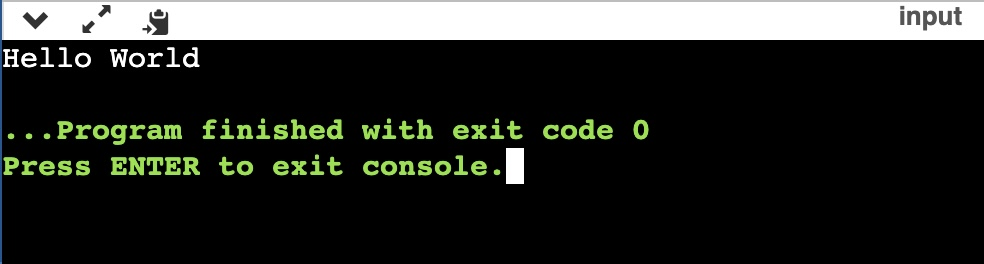
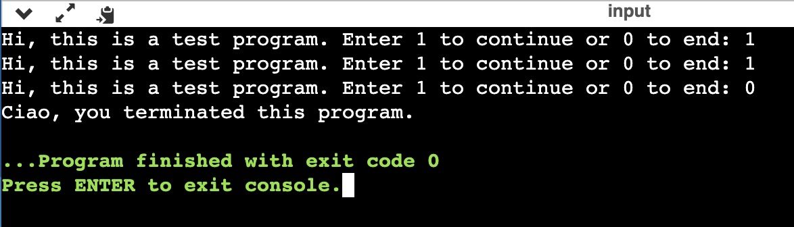
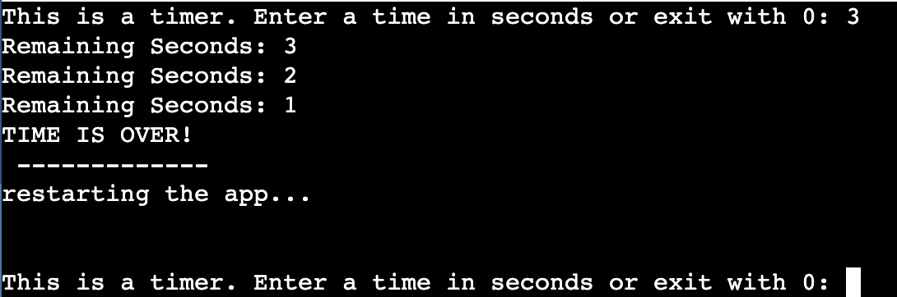

# Session 5 | 07.11.2022 - C++,  Application, Roundup

***Disclaimer:*** *This page offers supporting material for an Interaction Design course held at [KISD](https://kisd.de) in the winter term 2022/23. Visit the [landing page](https://github.com/KISDinteractive/fundamentals22w) of this course for more information.*


## 5.1 Compiling & Interpreting


## 5.2 Transfer to C++

The last language we learned was C++. This is a brief summary of its context:

- Enhancement / Extension of C
- published in 1985 by Bjarne Stroustrup 
- Extended until today
  - Language revisions: C++98, C++03, C++11, C++14, C++17, C++20, C++23
  - So-called "C with classes"
  - Today: Modern language with object orientation


C++ is a compiled language. Setting up all the tools and the workspace takes a lot of time. **This is why we used an [online IDE](https://www.onlinegdb.com/online_c++_compiler) and compiler for this exercise.**


### Hello World in C++

We started by looking at the basic components of a Hello World! program in C++:

- Include libraries by using `#include <LIBRARY-NAME>`

- With `using namespace std;` we allow all functions from the std (standard) namespace to be called directly

- The `main` function is special: 
  - runs only once (at the start and end of the program)
  - looping needs to be done by hand
  - is an `int` function (usually expects an int to be returned), but return is not mandatory
  
- Printing stuff to the console is done by `cout << "some text";`. 
  
  - which is different from most other languages. 
  - `cout` part of the `iostream` library.   
  - is used by putting the text in `" "` on the right side of `cout` and then adding a `<<` arrow-like thing in between them.
  
  
  

[See Code file or:](src/cpp/Code1_HelloWorld.cpp)

```cpp
#include <iostream>
using namespace std;
int main(){
    cout<<"Hello World";
    return 0;
}
```



### Looping and Breaking Loops

We then learned how to create an infinite loop (similar to draw() in Processing) by using `while (1){ }`.

All loops can be broken using the `break;` command. We do that whenever the input from the console (`cin >> x;`) is a 0. 

[See Code file or:](src/cpp/Code3_BreakLoops.cpp)

```cpp
//Example Code
#include <iostream>
using namespace std;

int main ()
{
    while (1) {
        int x = 0;
        cout << "This is a test. Enter 1 to continue or 0 to end: ";
        cin >> x;
        if (x == 0){
            break;
        }
    }
    cout << "Ciao, you terminated this program.";
}
```




### Task: a Timer App that Show Remaining Time

Participants were then given the task of coding an app themselves. The app should count down from a user-defined number to zero and print the remaining seconds to the console.

Solution ([see also code file](src/cpp/Code4_Timer-TaskSolution.cpp)):

```cpp
#include <iostream>
#include <unistd.h>
using namespace std;

int main() {
  while (1) {
    int x = 0;
    cout << "This is a timer. Enter a time in sec or exit with 0: ";
    cin >> x;
    
    //Exit if there is a 0
    if (x == 0) {
      break;
    } 
    
    //Do Timer things if there is sth else then zero
    else {
        
        //make another loop than counts down the seconds
      while (x > 0) {
        cout << "Remaining Seconds: " << x << endl;
        x--;
        usleep(1000000); //wait 1 sec (1000 millis * 1000 micros)
      }
      
      //print some nice finish lines
      cout << "TIME IS OVER!" << endl;
      cout << " ------------- " << endl;
      cout << "restarting the app..." << endl<< endl<< endl;
    }
  }
  
  //when we're here the program will finish!
  cout << "Timer has been terminated!";
}
```




## 5.3 Git & Github


## 5.4 Application Example

The last thing we did was going live through a big coding project including Git and Github, a complete C++ compiling toolchain and even crosscompilation between a Macbook and a Raspberry Pi Compute Module using Docker and Wifi.


## The END

If you have any Feedback regarding the course or us, please feel free to write us a mail or a  just post in spaces. 

**Congratulations! You just learned all the building blocks of code!** 
